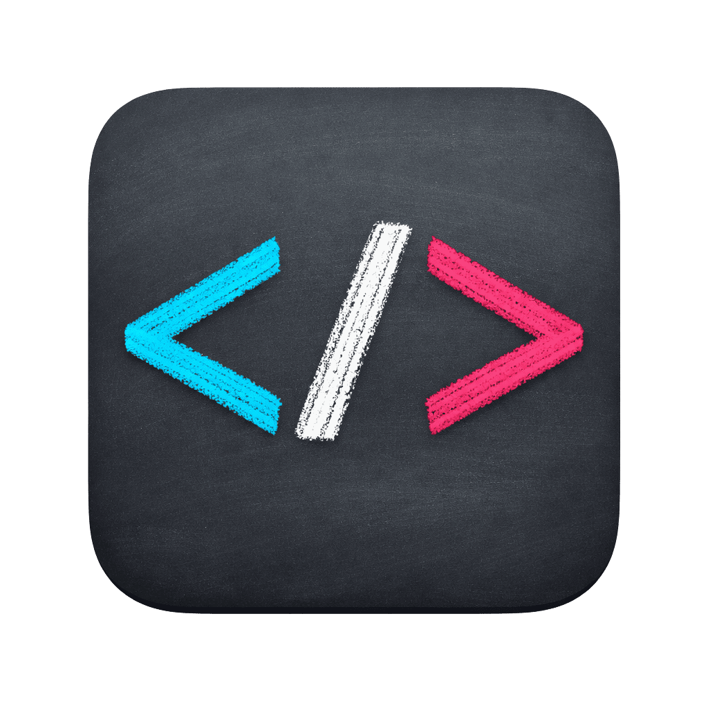
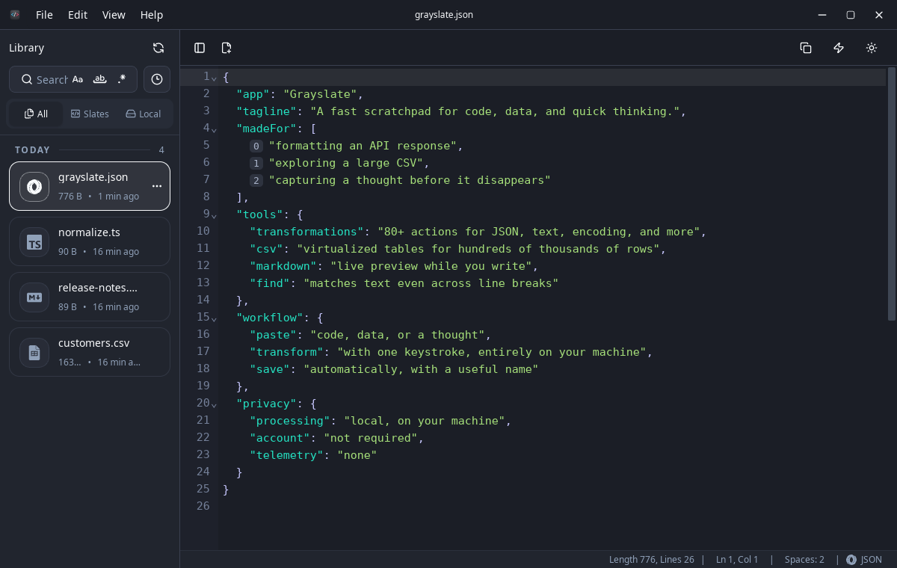
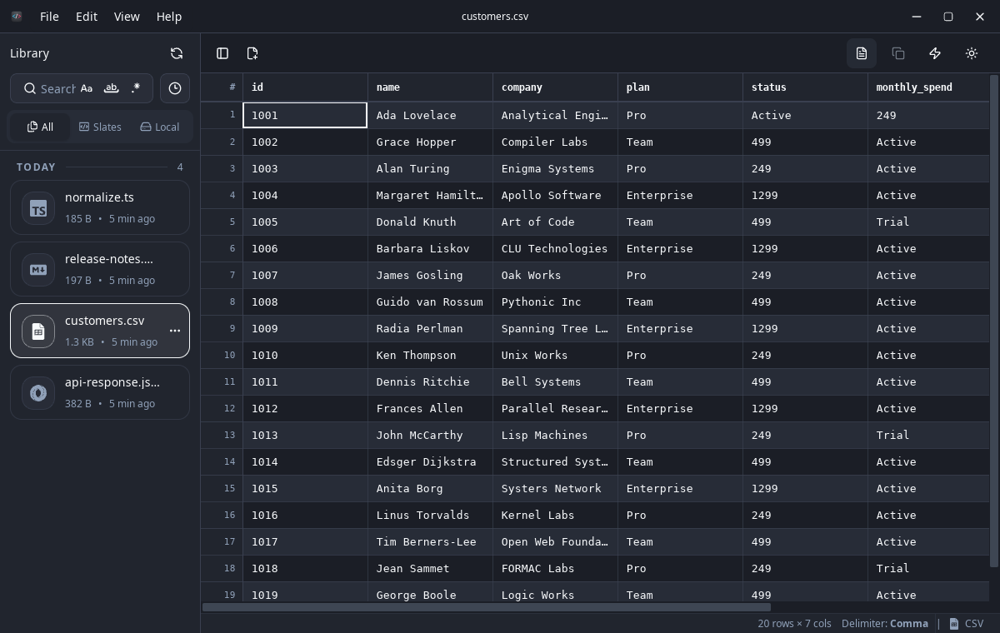
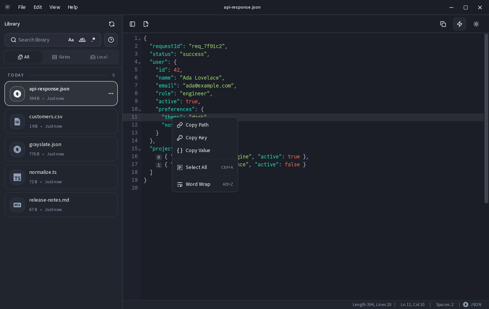
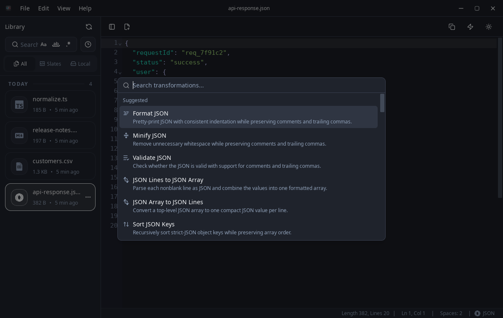

<div align="center">
  
  <h1>Grayslate</h1>
  <p><strong>A fast scratchpad for code, data, and quick thinking.</strong></p>

  <p>
    <a href="https://grayslate.app/#download">
      
    </a>
    <a href="https://github.com/shriram-ethiraj/grayslate/releases/latest">
      
    </a>
    <a href="https://github.com/shriram-ethiraj/grayslate/actions/workflows/e2e.yml">
      
    </a>
  </p>

  <picture>
    <source media="(prefers-color-scheme: dark)" srcset="docs/hero.png" />
    <source media="(prefers-color-scheme: light)" srcset="docs/hero-light.png" />
    
  </picture>
</div>

---

Grayslate is the window you keep open next to your main editor. Paste an API response. Explore a huge CSV. Transform text or capture a thought. Grayslate recognizes your content, suggests relevant transformations, and automatically names and saves each slate—so you can find it again whenever you need it.

## What it does

**Transform text without a website.** Grayslate detects the current document or selection and puts transformations matching its content type first. Formatting JSON, decoding Base64, converting CSV to JSON, hashing a string, and more are a keystroke away, and everything runs on your machine. There are 80+ built-in transformations; a sample is [below](#transformations).

**Open big CSVs.** The table view is backed by Rust and virtualized, so files with hundreds of thousands of rows open and scroll without the app grinding to a halt.

**Paste it now. Find it later.** Grayslate recognizes 40+ languages from the extension, a shebang, or the content itself. It picks a useful filename and extension, then automatically saves the note (a *slate*) as you type. Browse recent slates or search their names and contents whenever you need one again.

**Work with JSON faster.** Right-click a key or value to copy its path, key, or value, much like in Chrome DevTools.

There is also a live Markdown preview and multiline find and replace, including matches across line breaks.

Your files and transformations stay on your machine. No account, no cloud sync, no telemetry.

## Screenshots

<div align="center">
  <picture>
    <source media="(prefers-color-scheme: dark)" srcset="docs/csv.png" />
    <source media="(prefers-color-scheme: light)" srcset="docs/csv-light.png" />
    
  </picture>
  <br /><em>Large CSVs in a virtualized table</em>
  <br /><br />
  <picture>
    <source media="(prefers-color-scheme: dark)" srcset="docs/json-copy.png" />
    <source media="(prefers-color-scheme: light)" srcset="docs/json-copy-light.png" />
    
  </picture>
  <br /><em>Copy a JSON path, key, or value from the context menu</em>
  <br /><br />
  <picture>
    <source media="(prefers-color-scheme: dark)" srcset="docs/transforms.png" />
    <source media="(prefers-color-scheme: light)" srcset="docs/transforms-light.png" />
    
  </picture>
  <br /><em>Relevant transformations suggested from the detected content type</em>
</div>

## Download

### macOS

Download the [universal DMG](https://github.com/shriram-ethiraj/grayslate/releases/latest/download/grayslate-macos-universal.dmg) for Apple Silicon and Intel Macs.

Or install with Homebrew:

```bash
brew install --cask shriram-ethiraj/grayslate/grayslate
```

Grayslate is currently ad-hoc signed and not Apple-notarized. If macOS blocks the first launch, open **System Settings → Privacy & Security** and choose **Open Anyway** after confirming the download came from the Grayslate release.

### Windows

Choose the installer for your Windows device:

- [Windows x64](https://github.com/shriram-ethiraj/grayslate/releases/latest/download/grayslate-windows-x86_64-setup.exe)
- [Windows ARM64](https://github.com/shriram-ethiraj/grayslate/releases/latest/download/grayslate-windows-aarch64-setup.exe)

### Linux

Current Linux packages target x86_64. The recommended installer detects
Debian/Ubuntu/Mint or Fedora/RHEL-compatible systems, adds the official signed
APT or DNF repository, and installs Grayslate:

```bash
curl -fsSL https://packages.grayslate.app/install.sh | sh
```

Future versions then arrive through your normal system package manager and
Linux graphical update tools.

Prefer a standalone file? Download the
[AppImage](https://github.com/shriram-ethiraj/grayslate/releases/latest/download/grayslate-linux-x86_64.AppImage), then run:

```bash
chmod +x grayslate-linux-x86_64.AppImage
./grayslate-linux-x86_64.AppImage
```

Standalone versioned DEB/RPM files, all other artifacts, and checksums remain
available on the [Releases page](https://github.com/shriram-ethiraj/grayslate/releases).
Manual APT/DNF enrollment and troubleshooting steps are documented in the
[Linux package repository runbook](docs/linux-package-repository.md).

## Transformations

More than 80 built-in actions. A sample of what's there:

- **JSON** — format, minify, validate (comments & trailing commas allowed), sort keys, JSON ↔ YAML, JSON → CSV, JSON → TypeScript, array ↔ JSON-lines, query string ↔ JSON, rename keys to camel/snake/kebab/Title case.
- **CSV** — CSV → JSON (delimiter auto-detected), and JSON → CSV from the JSON side.
- **Encoding** — Base64 & Base64URL encode/decode, gzip ↔ Base64, hex ↔ ASCII, URL encode/decode, HTML entity encode/decode, decode a JWT (unverified).
- **Hashing** — SHA-256, SHA-512, SHA-1, MD5, CRC32.
- **Text & lines** — upper/lower/Title/camel/snake/kebab/sPoNgE case, sort lines, reverse lines, reverse string, remove duplicates, trim whitespace, collapse blank lines, ROT13, count words/lines/characters.
- **Numbers & time** — binary/decimal/hex conversions, Unix time ↔ RFC 3339.
- **Formatters** — JavaScript, TypeScript, CSS, HTML, Svelte, YAML, TOML, Markdown, SQL, XML.
- **Misc** — insert UUID v4/v7, add/remove slashes, defang/refang URLs.

## Tech stack

- **Frontend** — [SvelteKit](https://kit.svelte.dev/) + [Svelte 5](https://svelte.dev/), TypeScript
- **Editor** — [CodeMirror 6](https://codemirror.net/)
- **Styling** — [Tailwind CSS v4](https://tailwindcss.com/) + shadcn-svelte
- **Backend** — [Tauri 2](https://tauri.app/) (Rust)

Tauri means Grayslate uses your OS's built-in webview instead of bundling a whole browser, so the download is small and it's light on memory.

## Building from source

You'll need [Node.js](https://nodejs.org/) (v24+), [Rust](https://www.rust-lang.org/), and [pnpm](https://pnpm.io/).

```bash
git clone https://github.com/shriram-ethiraj/grayslate.git
cd grayslate
pnpm install
pnpm tauri dev      # run in development
pnpm tauri build    # produce an optimized build
```

## FAQ

**How is this different from Boop or Notepad++?**
Boop is centered on one-off transformations, while Notepad++ is a general-purpose editor. Grayslate is built around persistent scratch work: it recognizes pasted content, suggests relevant transformations, gives each new slate a useful name, auto-saves it, and lets you search for it later. It also handles real file editing and large CSVs on macOS, Windows, and Linux.

**Does Grayslate save my work automatically?**
New slates are named and saved automatically as you type, and remain available in the library for browsing or search. Files opened from elsewhere on your computer are never overwritten automatically—Grayslate writes changes to those files only when you explicitly choose Save.

**Why Tauri and not Electron?**
Electron ships an entire Chromium and Node runtime with every app. Tauri reuses the system webview and pairs it with a Rust backend, so bundles are far smaller and memory use is lower.

**Why not just use an online formatter?**
Because your data leaves your machine when you do. Proprietary code, API keys, customer CSVs — none of it should have to travel to a stranger's server just to get pretty-printed. Grayslate does it all locally.

**Can it handle very large files?**
Grayslate can open files up to 200 MB, whether they are CSV or regular text files. The CSV table is virtualized, so files with hundreds of thousands of rows remain practical to browse.

**Is it free?**
Yes. Free and open source.

## Roadmap

- **Git sync** — automatically version and back up your notes to a Git repo.
- **Custom transformations** — write your own and add them to the menu.

## Contributing

Contributions are welcome. If you find a bug or have an idea, open an issue. To
propose a change, fork the repository and open a pull request against `main`.
Please read the [contribution guide](CONTRIBUTING.md) for setup instructions,
project checks, and pull request expectations.

## License

MIT.
